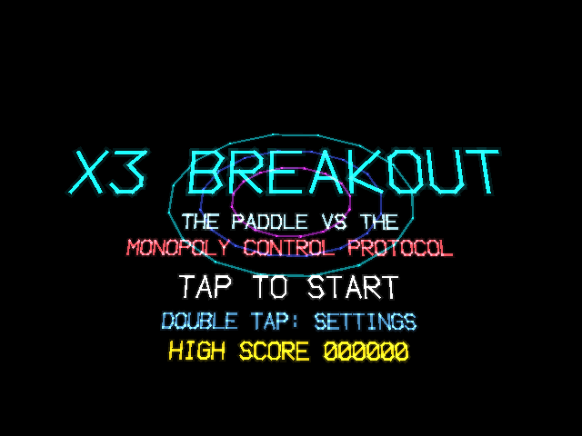
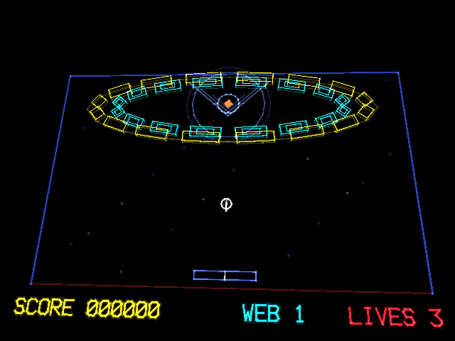

# X3 Breakout

X3 Breakout is a story-driven brick-breaker for the RayNeo X3 Pro AR glasses, pairing Arkanoid-style paddle-and-ball play with Tempest-style neon vector visuals. Across a sixteen-level campaign, you pilot a paddle framed as an open-source defense program against a corporate antagonist called the Monopoly Control Protocol, with each level's brick grid rendered as a distinct vector sigil that cracks and glitches as it falls. The campaign is fully voiced, with generated dialogue and taunts timed to level milestones and rendered as large, high-contrast captions. Paddle control uses a calibrated temple-pad swipe rather than a fixed mapping, so a full arm stroke is measured once and then scaled to the player's own reach.

## Screenshots

  
  

## Controls

- Swipe on the right temple pad to move the paddle (calibrated to your own full arm stroke)
- Tap to start the game or launch the ball
- Swipe in short steps to move the cursor in the settings menu
- Double-tap to open or close settings

## Download

[X3Breakout.apk](X3Breakout.apk)
